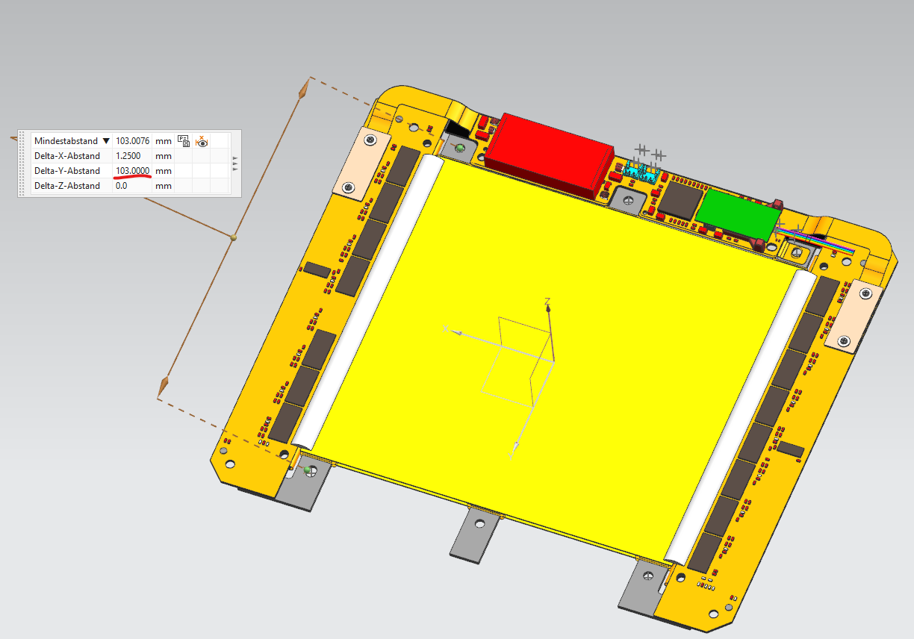
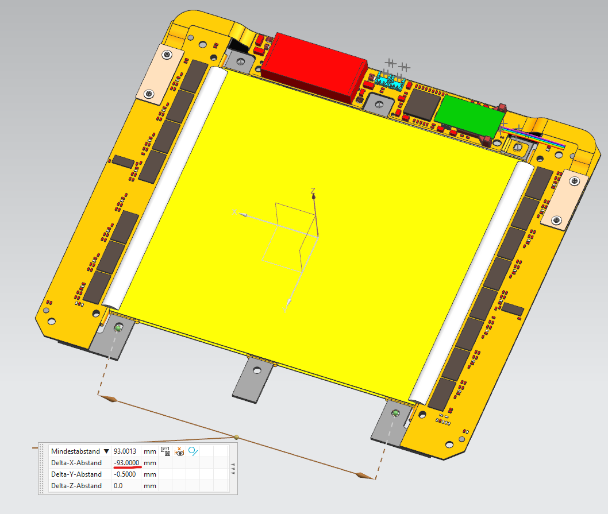
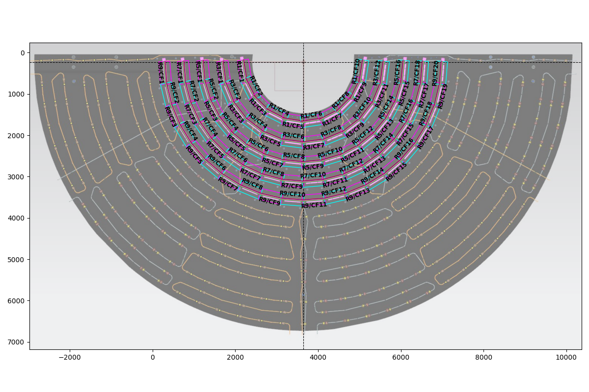
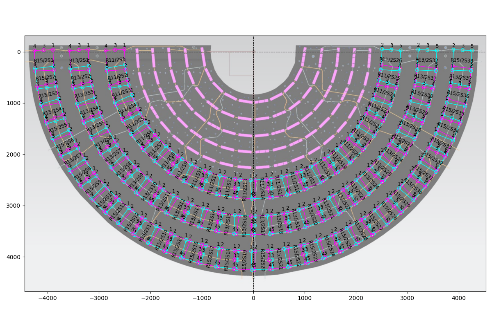
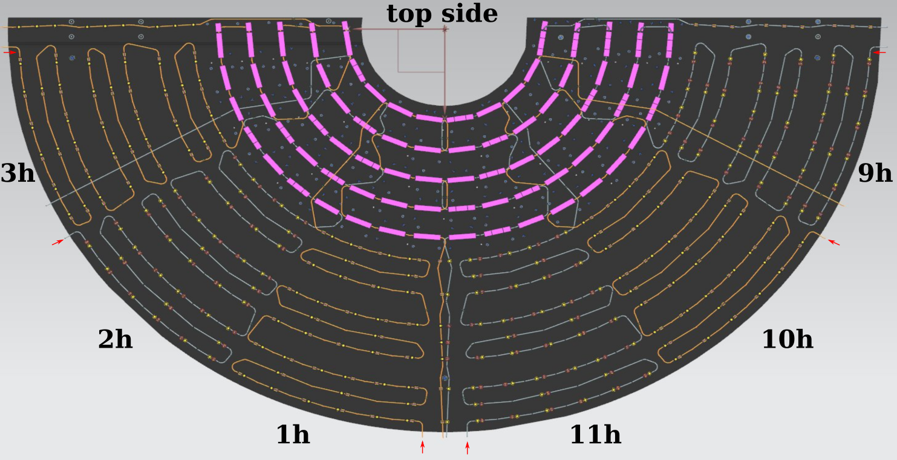
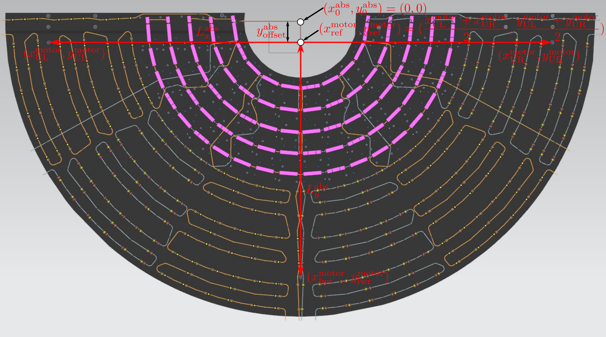
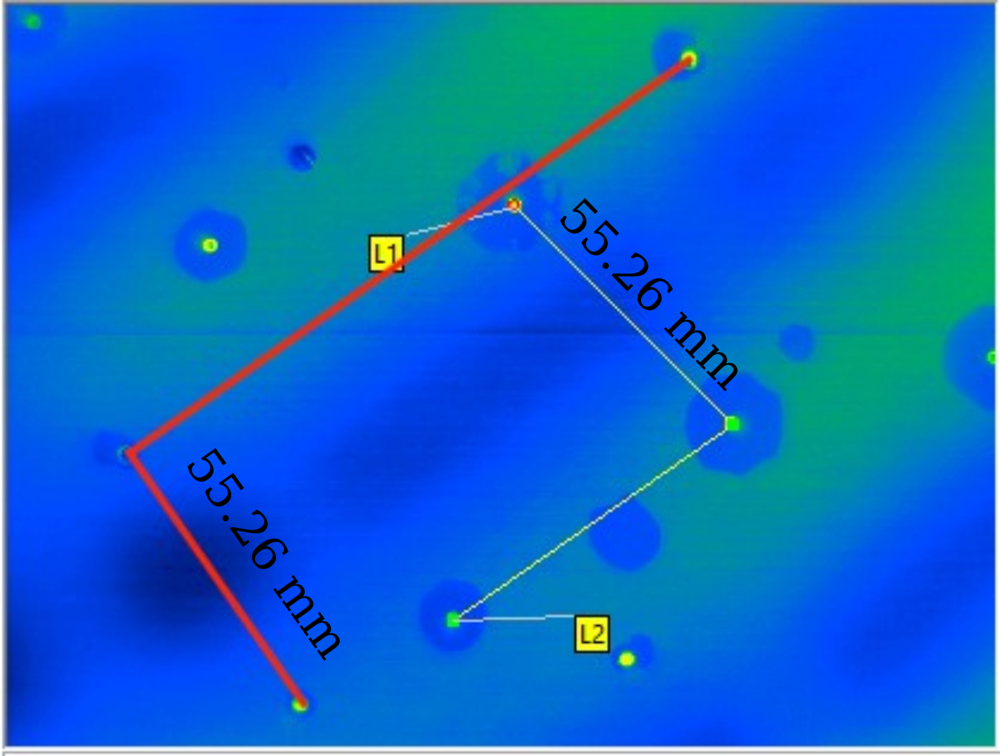

# Inputs

## Geometry
The geometry is provided in an `.xls` or `.xlsx` file (for e.g. [this](data/geometry_carbonFoam.xlsx)) containing the following columns:

1. `ring`:
the ring number

1. `r [mm]`:
the radial position (in mm) of the ring center

1. `phi [deg]`:
the $\phi$ position (in degrees) of the module centers

1. `meanWidth (orthoradial) [mm]`:<br>
PS: the active area length (in mm) perpendicular to the radius.<br>
2S: the insert-to-insert distance perpendicular to the radius, as shown below.<br>


1. `length (radial) [mm]`:<br>
PS: the active area length (in mm) along the radius.<br>
2S: the insert-to-insert distance along the radius, as shown below.<br>


1. `side`:
the module side should be `top` or `bottom`. Note that the DESY dee **top** (**bottom**) side corresponds to the side **without** (**with**) disk-to-disk inserts on the Lyon dee.

1. `insert outer radius (actual) [mm]`:
the 2S insert outer radius in mm.

1. `insert outer radius [mm]`:
the 2S insert outer radius scaled by `radius scale`. The code will pick the minimum temperature in this circle as the insert temperature. Using a slightly larger radius makes the insert alignment (and hence temperature extraction) easier.

1. `radius scale`:
a value of 2 is reasonable.

## Module and insert numbering scheme
In each ring, looking from the top side, as shown below, the PS module carbon foams (CFs) are numbered counterclockwise from 1, starting from $\phi=0$.
The CF labels must have the form `R<ring #>/CF<module #>`.
<br>

<br>
The 2S module numbering follows the same convention as described above.
Each module has 3 rings of inserts. They are numbered counterclockwise from 1, starting from the innermost ring.
The 2S module and insert label must have the form `R<ring #>/2S<module #>_ins<insert #>`.
<br>


## 2S insert cooling circuit roadmap
The cooling circuit numbering follows the convention shown below.
<br>

<br>
The roadmap consists of two files:

i. An `.xls` or `.xlsx` file (for e.g. [this](data/CoolingPipeRoadMap_DESY-dee-prototype.xlsx)) containing the following columns for each circuit.
The entries for each circuit corresponds to the inserts along that circuit.
**The direction of the numbering is shown by red arrows in the image above.**
   1. `ring`: ring number (value not used)
   2. `#`: insert number (value not used)
   3. `insert facing`: side the insert faces (`top` or `bottom`). **Must be the 3rd column.**
   4. `distance [mm]`: distance (in mm) from the previous insert (or from the start of the circuit in case of the first insert). **Must be the 4rd column.**

ii. A YAML file containing the insert labels for each circuit (for e.g. [this](data/coolingCircuit_2Sinserts_DESY-dee-prototype.yml)).
Each circuit should have an entry of the form:<br>
```yaml
circuit_3h:
      # Note that the dee is symmetric
      # So, the circuit path on one half can reflected to obtain the path of the symmetric circuit on the other half
      # For example: 9h <--> 3h
      reflect:
         name: circuit_9h
         transformation:
            module:
                # ring: transformation
                # For e.g. in ring 11, module M gets mapped to module (26-M+1) under reflection
                "11": "26-{module}+1"
                "13": "32-{module}+1"
                "15": "38-{module}+1"
            insert:
                # insert: transformation
                # The insert numbers also transform under the reflection
                # For e.g., insert 1 gets mapped to insert 2 under reflection
                "1": "2"
                "2": "1"
                "3": "3"
                "4": "5"
                "5": "4"
      inserts:
         # List of inserts for this circuit
         # The direction MUST be the same as that mentioned above
         # How to get this list: refer to the GUI help message when running python/stitch_images.py
         - R15/2S2_ins4
         - R15/2S1_ins5
         - R15/2S3_ins4
         ...
```

# Extracting information from IR images

Reference for the coordinate system and alignment:<br>


Run `python python/stitch_images.py --help` to see the options.

1. `--motorRefX` and `--motorRefY`:
record the motor coordinates (i.e. steps) of one reference insert on each half of the dee.
Choose a pair of symmetric ones to make life easier, and call them the upper left (UL) and upper right (UR) reference inserts.
Their motor coordinates are $(x^\text{motor}_\text{UL}, y^\text{motor}_\text{UL})$ and $(x^\text{motor}_\text{UR}, y^\text{motor}_\text{UR})$.
Then the motor reference point $(x^\text{motor}_\text{ref}, y^\text{motor}_\text{ref})$ is obtained as shown above.
If symmetric points are chosen, then $x^\text{motor}_\text{ref}$ should coincide with $x=0$ of the absolute coordinates, i.e. $x^\text{abs}_0$.
Hence one can pass:<br>
`--motorRefX` $x^\text{motor}_\text{ref}$ 0
<br>
However, $y^\text{motor}_\text{ref}$ is unlikely to be at $y^\text{abs}_0$.
If $y^\text{abs}_\text{UL}$ ($=y^\text{abs}_\text{UR}$ for a symmetric pair) is known, then one can pass:<br>
`--motorRefY` $y^\text{motor}_\text{ref}$ $y^\text{abs}_\text{UL}$
<br>
One, both, or neither of these can be provided, but it is recommended to provide `motorRefX` at least.

1. `--originX` and `--originY`:
it might happen that `motorRefX` and `motorRefY` do not align the stitched image and the mesh well enough (say there is an offset), or say $y^\text{abs}_\text{UL}$ is not known.
Then one can provide the pixel position where the origin should be placed.
One, both, or neither of these can be provided.

1. `--stepxtomm` and `--stepytomm`:
knowing the absolute lengths (in mm) $L^\text{abs}_x$ and $L^\text{abs}_y$, one can pass (math operations are allowed in the string):<br>
`--stepxtomm` "$L^\text{abs}_x$/$\lvert x^\text{motor}_\text{UR} - x^\text{motor}_\text{UL} \rvert$"<br>
`--stepytomm` "$L^\text{abs}_y$/$\lvert y^\text{motor}_\text{ref} - y^\text{motor}_\text{lwr} \rvert$"
<br>

1. `--mmtopix`:
measuring the distance between inserts in pixels one can provide (math operations are allowed in the string):<br>
`--mmtopix "<length in pixels>/<length in mm>"`
<br>
Example for PS modules shown below. Numbers for 2S modules can be obtained similarly.
<br>


1. `--cadImage <PNG file>`:
path to the CAD image.

1. `--mmtopixCad`:
conversion from mm to pixels fot the CAD image.
This can be provided the same way as `--mmtopix`.

1. `--cadImageOrigin <x> <y>`:
position (in pixel coordinates) where the origin will be placed on the CAD.

1. `--isPrototype`:
provide this flag for the DESY and Lyon prototype dees.

1. `--coolCircFiles <file>`:
this is the cooling circuit YAML file described above.
More than one file can be provided.

1. `--loadSave <file>`:
once the alignment, module-image association, etc. are satisfactory, the configuration can be saved from the GUI.
This configuration can be loaded again with this argument.

1. `--saveFigsTo <directory>`:
will save figures and extracted data to this directory and close the program. No interactive GUI.

# Obtaining the insert list of a cooling circuit


# Running t